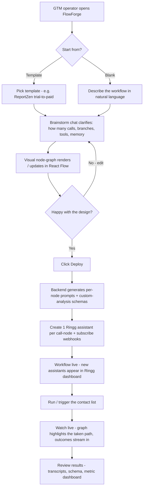
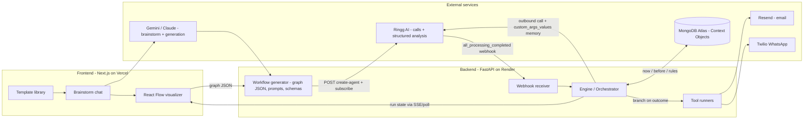
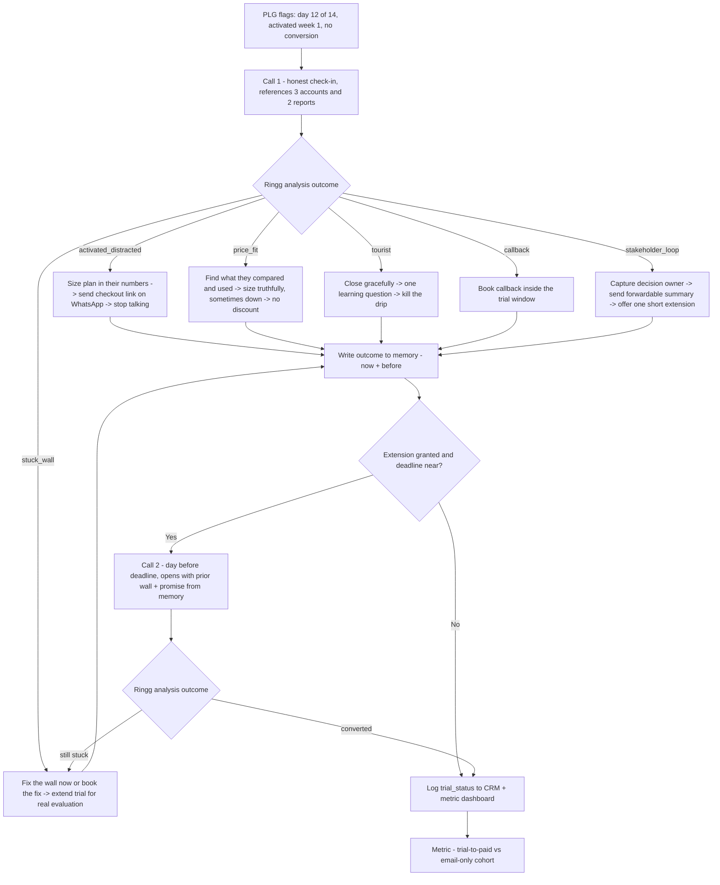

# Build Plan — "FlowForge": a conversational architect for multi-agent voice workflows on Ringg AI

> GrowthX × Ringg AI Voice AI Buildathon · finalized 2026-06-14
> Scored demo workflow: **ReportZen** — trial-to-paid voice agent for small Indian digital-marketing agencies.

---

## 1. The product (one line)

**A conversational workflow architect.** A GTM operator describes the outreach workflow they want; the
system **brainstorms** with them (clarifying Q&A), renders it as a **visual node-graph**, then **generates
and deploys** a *multi-agent* voice workflow onto Ringg AI + side tools, and **runs it live**. Ringg handles
the calls; our engine handles everything *between and after* the calls — branching, tool calls, and memory
across handoffs.

### Hero vs. scored
- **Builder + visualizer = the narrative wow** ("this is a platform, not a one-off").
- **One deep, domain-specific workflow run live = what actually scores.** The rubric gives **0 points for a
  builder**; all 100 are scored on a *running* agent. So the demo arc is: **describe → co-design → deploy
  (agents appear in Ringg) → place the live call → job completes → metric.**

---

## 2. Finalized idea — ReportZen (the scored workflow)

- **Product:** white-label **client-reporting & analytics SaaS for small Indian digital-marketing agencies
  (10–30 people).** Opt-in 14-day trial. ACV ≈ **₹60k/yr** — Studio ₹5k/mo (≤5 client connections), Pro
  ₹12k/mo (past 10).
- **Workflow (idea #20, "Trial users in the final 72 hours"):** a voice agent that calls the
  **activated-but-stalled** cohort in their **final 72 hours**, diagnoses **distracted vs. stuck vs.
  tourist**, removes the exact friction, and converts before the timer runs out. **Multi-call with memory:**
  extension granted → day-before-deadline check-in carrying the prior wall + promise.
- **Why this ICP:** narrow + phone-reachable (SMB owner answers) + concrete activation wall + credible ACV +
  writable operator nuance + Bengaluru-judge resonance. Data backs it (see §9).

### Operator dossier (this is what makes Domain-nuance L5)
- **Who picks up:** agency founder / ops lead. Busy, allergic to fake urgency, decides fast when the path is
  effortless. The *stuck* version is quieter — won't volunteer the wall unless asked plainly.
- **Activation milestone (the 4× event):** ≥3 client accounts connected **and** ≥1 white-label report sent.
- **Top real walls (the specific friction):**
  1. Meta/Google account **OAuth permission fail** when connecting a client.
  2. **White-label branding** setup confusion (logo/domain).
  3. **Seat limit** blocks inviting a teammate.
  4. **CSV import** fails on date-format.
  5. **"Co-founder owns the card"** stakeholder loop.
- **Pricing/sizing rule:** size by client-connection count — Studio ≤5, Pro past 10. *Size truthfully,
  sometimes downward. No discount reflex.*
- **Language/nuance:** agency jargon (retainers, white-label, reporting cadence, client churn); Hindi/English
  **code-switch** if the user prefers; answer data-retention questions factually even when it eases leaving.
- **"Never" rules:** never invent urgency on top of the real deadline; never extend reflexively to dodge a
  no (extensions are for *stuck* evaluations with a named blocker); never go around the evaluator to their
  boss; never push annual on an undecided monthly.

### Branch set (= Ringg custom-analysis `outcome` enum = graph edges)
`activated_distracted | stakeholder_loop | stuck_wall | price_fit | tourist | callback`

### Structured output schema (per call)
```json
{
  "trial_id": "T-88412",
  "trial_status": "activated_distracted | stakeholder_loop | stuck_wall | price_fit | tourist",
  "wall_description": null,
  "extension_granted": false,
  "extension_days": 0,
  "plan_fit": "Studio",
  "decision_owner": "co-founder (rubber stamp)",
  "checkout_link_sent": true,
  "converted_on_call": false,
  "call_duration_sec": 196
}
```

---

## 3. Architecture (decisions locked in the grilling session)

```
Frontend (Next.js / Vercel)                      Backend (FastAPI / Render)                 Ringg AI
─────────────────────────────                    ──────────────────────────                 ─────────
Template library  ─┐                              Brainstorm LLM (Gemini/Claude)
Brainstorm chat  ──┼──▶ workflow graph (JSON) ──▶ → generate graph + per-node prompts
React Flow graph ─┘                               Deploy: POST /agent/create-agent  ───────▶ creates 1 assistant/node
                                                  PATCH /agent/v1 (subscribe webhooks) ────▶ webhooks → backend
Visualizer lights up ◀── run state (SSE/poll) ──  Engine (orchestrator):
the taken path                                      place call → POST /calling/outbound/individual ─▶ live call
                                                    branch on all_processing_completed.outcome
                                                    fire tools (Resend email / Twilio WA / schedule)
                                                    write memory ↔ MongoDB Atlas
```

**Locked decisions:**
1. **Node → Ringg = (A) one assistant per call-node, created at *deploy* time** via `POST /agent/create-agent`
   (single prompt-based flow). Store each `agent_id` in the graph; subscribe its webhooks via
   `PATCH /agent/v1` `edit_event_subscriptions` → backend callback. **True multi-agent.** Create at deploy,
   never mid-call (keeps the risky API work off the live moment; new assistants visibly appear in the Ringg
   dashboard during the demo).
2. **Branching = (A) Ringg Custom Analysis schema.** Each node's branch set is authored as a custom-analysis
   schema; Ringg returns the structured `outcome` in `all_processing_completed`; engine follows the matching
   graph edge **deterministically**. **LLM-over-transcript only as a fallback** when `outcome` is
   missing/`unreachable`/low-confidence.
3. **Memory = 3-layer Context Object** per contact, mapped to the rubric:
   - `now` — current run state (this call's outcome, captured fields, current node).
   - `before` — history (prior calls, prior outcomes, prior promises, prior walls). *The layer almost nobody
     builds = the L5 differentiator.*
   - `rules` — template policy (extension policy, pricing/sizing rule, "never" rules, escalation logic).
   - **Threading:** compile a compact `@{{memory_summary}}` + typed fields (`@{{days_left}}`,
     `@{{activation_summary}}`, `@{{last_promise}}`) into `custom_args_values` before each call; **write back**
     the structured outcome to `before` after each `all_processing_completed` webhook.
   - **Demo payoff:** the day-before call opens *"Last week you said the data-import wall was the blocker and
     I extended you 3 days — did that import go through?"* — visibly references state the first agent captured.
   - **Store:** **MongoDB Atlas** (MCP already wired; nested namespaces fit a document naturally). Supabase
     Postgres is the fallback. (Render's free disk is ephemeral — must use an external store.)
4. **Tools (side-effect nodes):**
   - **Calls:** Ringg (`X-API-KEY`, `https://prod-api.ringg.ai/ca/api/v0`).
   - **Email:** **Resend** (free: 100/day, 3,000/mo) — checkout link, forwardable summary.
   - **WhatsApp/SMS:** **Twilio WhatsApp Sandbox** (free, no DLT, demoable) for the "link sent" beat; SMS is a
     checkbox.
   - **LLM:** Gemini `2.0-flash` (free tier) for brainstorm + generation; **Claude** preferred for strict
     workflow-JSON output (already wired).
5. **Frontend:** Next.js + **React Flow** visualizer + brainstorm chat + template library + Deploy/Run
   controls; live run-state highlights the taken path.
6. **Video (HyperFrames) = V3 async garnish only.** HTML→MP4 personalized trial-recap emailed via Resend, on
   one branch, **rendered async off the live critical path, pre-rendered fallback.** Render on laptop, *not*
   Render free tier (headless Chrome OOM). Build only after the core loop is solid. Not scored-critical.

---

## 3b. Diagrams

### 3b.1 User flow — the GTM operator building a workflow



### 3b.2 Architecture



### 3b.3 Customer flow — the trial user's call journey (ReportZen workflow)



## 4. Rubric strategy (target: maximize the 100)

| Parameter | Wt | Target | How we get there |
|---|---|---|---|
| **Job-to-be-done** | 30 | **L4–L5** | Live call completes the job + real artifacts (checkout link sent via Resend/WA, extension logged with named blocker, schema emitted, written to Mongo). Run 3 repeated cases. Live surface (not mocked) pushes past the L3 cap. |
| **Domain nuance** | 30 | **L5** | Operator dossier (§2): real walls, plan-sizing in their numbers, Hindi/English, "never" rules, no fake urgency, no discount reflex. |
| **Memory & Context** | 20 | **L5** | 3-layer `now/before/rules` surviving the call→extension→day-before handoff; second agent references first agent's captured wall + promise. |
| **Business Impact** | 20 | **L4–L5** | §5 math with baseline + pessimistic + expected scenarios and ₹ figures. |

Mocked surfaces cap Job-to-be-done at L3 → we use **live Ringg calls + real Resend/WhatsApp sends** to clear L4/L5. Voice loop runs **live on stage** (recording as fallback only).

---

## 5. Business impact (the slide — pessimistic + expected)

- 400 self-serve trials/mo · baseline trial-to-paid **12%** → 48 paid.
- ~35% are *activated-but-stalled* in the final 72h ≈ **140 reachable**; voice reaches ~60% ≈ **84 calls/mo**.
- **Expected:** +20 conversions/mo → ~**17%** on the contacted cohort (**>25% relative lift = L5**).
  20 × ₹60k = **₹1.2 cr additional ARR/yr.**
- **Pessimistic:** +10 conversions/mo → **₹60 L additional ARR/yr** (still L4).
- Metric line: **trial-to-paid conversion · activation rate · CAC payback.**

---

## 6. Demo script (3 min, 4 beats — per handbook Demo Prep)

1. **Context (30s):** "Small agencies activate in week one, then a client fire buries them. The 14-day trial
   dies on a countdown email nobody answers. 88% never convert."
2. **Workflow (30s):** Open FlowForge → pick the ReportZen trial-to-paid template → tweak one branch live in
   the brainstorm chat (proves the builder) → **Deploy** → assistants appear in the Ringg dashboard.
3. **Live demo (90s):** Place the live call to the on-stage phone. Agent opens with the honest question,
   references the *3 connected accounts / 2 reports*, sizes the **Studio** plan in their numbers, sends the
   **checkout link live (WhatsApp)**, handles the "co-founder owns the card" loop. Branch fires on the graph.
   (If a stuck-wall case: fix/extend → show the day-before call carrying memory.)
4. **Impact (30s):** the ₹1.2 cr expected / ₹60 L pessimistic, vs. the email-only cohort.

Backup recording ready. Cold open rehearsed.

---

## 7. Build timeline (≈4 hours, adapted from brief #20)

- **0–30 min — skeleton:** ReportZen assistant on Ringg, friendly voice, V1 prompt; first live test call to
  own number; transcript captured.
- **30–60 min — conversation works:** all 6 branches reachable; opening line replaces the countdown email;
  "just haven't gotten to it" → sized plan + live link → silence.
- **1–2 h — survives the breaks:** off-script cases (extension beggar, discount haggler, competitor-trial);
  fallback for each; zero fake urgency; data-retention honesty test. **V2: memory + resend-on-demand links.**
- **2–3 h — structured output:** every call ends with the schema (`trial_status`, `wall_description`,
  `plan_fit`); variables wired (days-left, activation summary); call data lands in Mongo + visible on the UI.
- **3–4 h — wire to business, then stop:** extensions log with named blocker; stuck+extended trials get the
  day-before check (memory handoff); full demo path run twice; **lock the version, rehearse the story.**

**Foundation already shipped (today):** Next.js frontend on Vercel (https://growthx-ringg.vercel.app),
FastAPI backend on Render (https://growthx-ringg-backend.onrender.com), CI/CD (GitHub Actions → Vercel +
Render), Vercel/Render MCPs, MongoDB Atlas MCP available. We extend these, not start from zero.

---

## 8. Risks & mitigations

| Risk | Mitigation |
|---|---|
| Ringg **credits fail silently** when exhausted | Check `GET /workspace` credits before the live call (coupon `RINGG-BUILDATHON-BLR`, ~83 min). |
| Live call drops on stage | Backup recording; narrate intended behavior, recover, move on. |
| Recording URL **expires in 24h** | Download/store right after the call if needed for the demo. |
| Ringg **KB endpoint 10/hour** rate limit | Pre-build knowledge bases; don't generate per-deploy on stage. |
| Branch misfire | Deterministic Ringg `outcome` spine + LLM fallback; rehearse the exact cases. |
| Render free **cold start / headless-Chrome OOM** | Warm the backend before demo; render HyperFrames video on laptop / pre-rendered. |
| Assistant creation flaky live | Create at **deploy**, not mid-call; A-lite fallback = pre-created assistant shells. |
| Scope sprawl (whole funnel) | Build **one** transition deep; full funnel is narrative only. |

---

## 9. Sources (research behind the ICP & numbers)

**Trial-to-paid / PLG benchmarks**
- 1Capture — Free Trial Conversion Benchmarks 2025: https://www.1capture.io/blog/free-trial-conversion-benchmarks-2025
- Growthspree — B2B SaaS Trial-to-Paid Benchmarks 2026 (by trial type, ACV, vertical): https://www.growthspreeofficial.com/blogs/b2b-saas-trial-to-paid-conversion-rate-benchmarks-2026-by-trial-type-acv-length-credit-card
- Baremetrics — Trial-to-Paid Conversions: Benchmarks, Fixes & Growth Impact: https://baremetrics.com/blog/trial-conversion-rate-metrics-explained
- ProductLed — Product-Led Growth Benchmarks: https://productled.com/blog/product-led-growth-benchmarks
- ChartMogul — The SaaS Conversion Report: https://chartmogul.com/reports/saas-conversion-report/
- Userpilot — SaaS Average Free Trial Conversion Rate: https://userpilot.com/blog/saas-average-conversion-rate/
- ADV.me — SaaS Free Trial Conversion Rate Benchmarks: https://adv.me/articles/conversion-optimization/saas-free-trial-conversion-rate-benchmarks-2025/

**The 7-day cliff / why PLG trials fail**
- The Growth Terminal — Free Trial Conversion: The 7-Day Cliff: https://www.thegrowthterminal.com/blog/free-trial-conversion-the-7-day-cliff-and-how-to-beat-it/
- ProductLed — Why PLG Fails 90% of the Time: https://productled.com/blog/we-fix-the-free-trial-you-fixed-why-plg-fails-90-of-the-time
- ProductFruits — 12 strategies to convert trial users during onboarding: https://productfruits.com/blog/strategies-to-convert-trial-users
- Hacker News — "A fourteen-day free trial ain't gonna cut it": https://news.ycombinator.com/item?id=40274662

**Vertical / SMB SaaS onboarding & activation**
- SaaStr — Why Vertical SaaS Is Booming & 110% NRR from SMBs (Jason Lemkin × MangoMint): https://www.saastr.com/why-vertical-saas-is-booming-and-how-to-get-110-nrr-from-smbs-with-jason-lemkin-mangomints-ceo
- Flowjam — SaaS Onboarding Best Practices 2025: https://www.flowjam.com/blog/saas-onboarding-best-practices-2025-guide-checklist
- Appcues — SaaS Onboarding Examples: https://www.appcues.com/blog/saas-user-onboarding

**Ringg AI & framework references**
- Ringg AI skill (local): `info/ringg-ai-skill.md` · Docs: https://docs.ringg.ai · Create Agent endpoint:
  https://docs.ringg.ai/api-reference/endpoint/assistant/create-agent.md · Nav: https://docs.ringg.ai/llms.txt
- Idea brief #20 (local): `info/idea-library-complete.json` (id `p20`)
- HyperFrames (V3 video garnish): https://github.com/heygen-com/hyperframes
- Handbook archive (local): `info/README.md`
